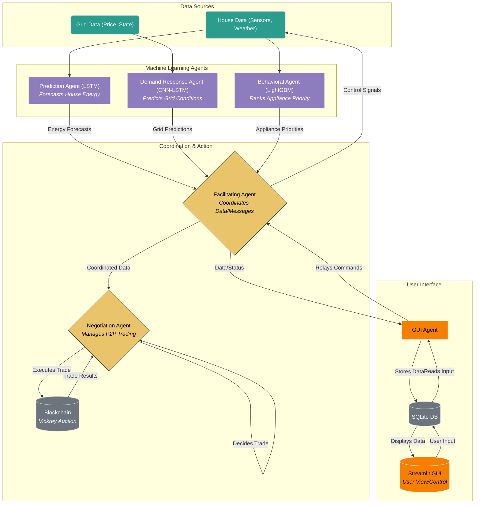
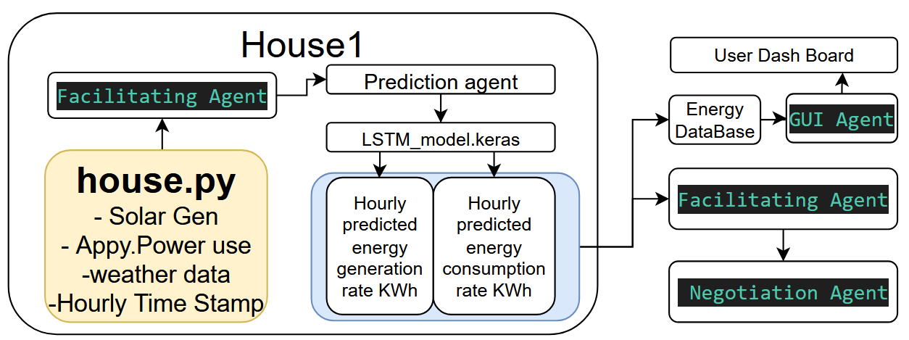
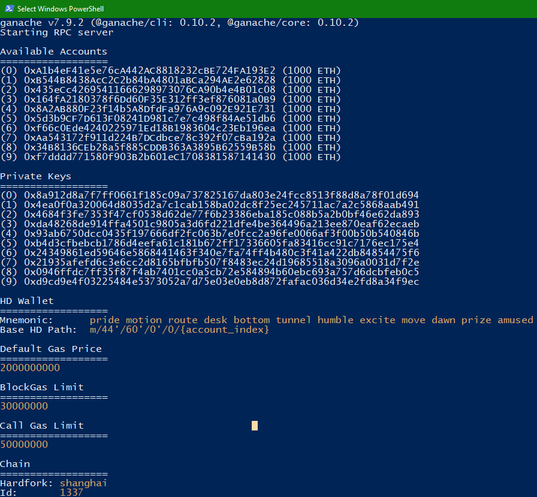

# Smart Home Energy Management System with Multi-Agent Collaboration

[](https://opensource.org/licenses/MIT) <!-- Placeholder License Badge -->

A proof-of-concept Smart Home Energy Management System utilizing multi-agent collaboration, machine learning for predictions, and blockchain for secure peer-to-peer energy trading. Developed as a course project for ESOF-5014 (Agile Software Development) at Lakehead University.

## Overview

This project addresses the challenges of managing local renewable energy generation, predicting consumption, and enabling fair Peer-to-Peer (P2P) energy trading in smart homes. We developed a system based on multi-agent collaboration using the **SPADE** framework, integrating **Machine Learning** models for forecasting and **Blockchain** technology for decentralized trading.

## Key Features

*   **Multi-Agent System (MAS):** Uses the SPADE framework for coordinated agent actions (Prediction, Demand Response, Behavioral Segmentation, Negotiation, Facilitation).
*   **Energy Forecasting:** Employs an **LSTM** model to predict hourly energy consumption and solar generation based on historical data and weather features (R² ≈ 0.66 on test data).
*   **Demand Response Prediction:** Utilizes a **CNN-LSTM** model to forecast grid supply/demand signals (performance limited by available dataset size).
*   **Intelligent Curtailment:** A **LightGBM Ranker** model prioritizes appliances based on behavioral patterns for efficient load shedding during curtailment periods.
*   **P2P Energy Trading:** Implements a **Vickrey (second-price sealed-bid) auction** using a **Solidity smart contract** deployed on a local Ganache blockchain via Truffle, ensuring fair and transparent trading.
*   **Decentralized Coordination:** A Facilitating Agent manages inter-agent communication and data dependencies using XMPP.
*   **User Interface:** A Streamlit GUI provides visualization of system status, energy data, and trading activity via an SQLite database intermediary.
*   **Agile Development:** Developed iteratively using a Scrum-based methodology with Jira for task management and GitHub for version control.

## System Architecture

The system employs a multi-agent architecture coordinated by a Facilitating Agent. Each agent performs a specialized task, interacting via messages. The Negotiation Agent interfaces with the blockchain for trading.



*High-level deployment view of prediction Agent, negotiation Agent and facilitating Agent.*

## Core Technologies

*   **Programming Language:** Python 3
*   **MAS Framework:** SPADE (Smart Python Agent Development Environment)
*   **Machine Learning:** TensorFlow/Keras (LSTM, CNN-LSTM), LightGBM, Scikit-learn, Pandas
*   **Blockchain:** Solidity, Truffle Framework, Ganache, Web3.py
*   **Database:** SQLite
*   **GUI:** Streamlit
*   **Version Control:** Git, GitHub
*   **Project Management:** Jira (Agile/Scrum)

## Key Components (Agents)

1.  **Prediction Agent:** Forecasts household energy consumption and solar generation using an LSTM model.
2.  **Demand Response Agent:** Predicts grid energy supply/demand using CNN-LSTM models and signals potential curtailment needs.
3.  **Behavioral Segmentation Agent:** Ranks appliance usage priority using a LightGBM Ranker for smart load shedding.
4.  **Negotiation Agent:** Manages P2P energy trading by participating in Vickrey auctions orchestrated by the blockchain smart contract.
5.  **Facilitating Agent:** Coordinates communication and ensures data dependencies are met between agents.
6.  **GUI Agent:** Interfaces between the MAS and the Streamlit UI via an SQLite database.
7.  **(Simulated) House/Grid Agents:** Provide data inputs and act on decisions.

## Results Highlights

*   Successfully integrated MAS, ML models, and Blockchain for a functional proof-of-concept.
*   Prediction Agent achieved reasonable accuracy (R²=0.657, RMSE=0.13 scaled) for forecasting.
*   Vickrey auction mechanism tested successfully on Ganache using `test_Auction.py`, demonstrating correct winner determination and second-price settlement for fair P2P trading.
  
  


*   Facilitating Agent effectively managed agent dependencies and message flow.
*   Streamlit GUI provided a functional interface for monitoring system status and energy data.



*Ganache simulation blockchain of 10 account with 1000 eth each for trading*


*Example: GUI showing blockchain auction status.*

## P2P Trading & Potential Savings

The system enables households to trade surplus energy (e.g., from solar panels) directly with neighbors. By using a Vickrey auction, the winning buyer pays the second-highest bid price. This mechanism incentivizes truthful bidding and allows participants to potentially buy energy cheaper than peak grid prices, leading to cost savings, especially during high-cost Time-of-Use periods. Bidding strategies (Conservative, Neutral, Aggressive) allow users to tailor their participation based on risk preference.

## Installation

*(Instructions would typically go here - Requires Python, pip, potentially Node.js/npm for Truffle/Ganache)*

1.  **Clone the repository:**
    ```bash
    git clone <your-repo-url>
    cd <your-repo-name>
    ```
2.  **Set up Python environment:** (Using venv is recommended)
    ```bash
    python -m venv venv
    source venv/bin/activate # On Windows use `venv\Scripts\activate`
    ```
3.  **Install dependencies:**
    ```bash
    pip install -r requirements.txt
    ```
4.  **Blockchain Setup:**
    *   Install [Ganache](https://trufflesuite.com/ganache/) (UI or CLI).
    *   Install [Truffle](https://trufflesuite.com/truffle/): `npm install -g truffle`
    *   Navigate to the blockchain directory (e.g., `cd blockchain`)
    *   Compile and deploy the contract:
        ```bash
        truffle compile
        truffle migrate --network development # Ensure Ganache is running
        ```
    *   Note the deployed contract address (Truffle output) and ensure it's accessible to the Negotiation Agent (e.g., via a `.env` file or config).

## Running the System

```
python main.py
```

<video controls src="Images/Final-Smart Home Energy Management System with Multi-Agent Collaboration.pptx - Google Slides — Mozilla Firefox 2025-04-17 13-49-29.mp4" title="Title"></video>


## Testing

The system includes various tests:

*   **Unit Tests:** Validate individual agent logic and model loading (e.g., `Test_PredictionAgent.py`).
*   **Blockchain Contract Tests:** End-to-end functional testing of the Vickrey auction smart contract using Truffle/Web3.py against Ganache (`test_Auction.py`).
*   **Integration:** Verified implicitly through successful agent message passing and coordinated behavior via the Facilitating Agent.
*   **ML Model Validation:** Standard train/validation/test splits were used during model development.


*Example structure of testing files.*


*Example Lunch of SPADE Multi-Agent System.*

## Future Work

*   Improve ML model accuracy with larger/more diverse datasets and advanced techniques (e.g., Transformers, attention).
*   Incorporate Reinforcement Learning for adaptive agent strategies.
*   Evaluate system scalability with more simulated homes.
*   Enhance simulation realism (battery models, detailed grid dynamics).
*   Explore hardware integration with real smart home devices.
*   Investigate alternative P2P market mechanisms.

## Team Members

*   Justin Vaughan (1095207) - *Representative PO, Prediction Agent, GUI Development, Testing, Blockchain, Behavioral Agent,System Testing, QA, Reporting, Scrum Master*
*   Russell Frost (100542) - *System Architecture, Backend/Frontend Dev, Agent Integration, Blockchain, Demand Agent Testing, System Testing, QA, Reporting, Sprint Planning*

*(Based on Agile Process section)*

---

*This project was developed for the ESOF-5014 course at the Department of Electrical and Computer Engineering, Lakehead University.*
